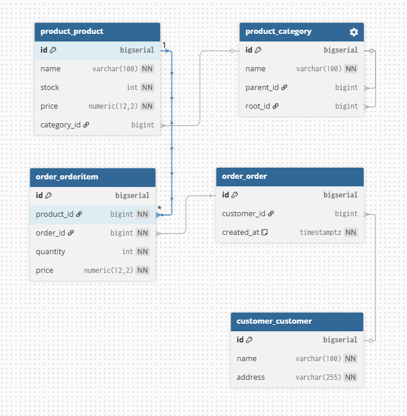

# Тестовое Задание.

## 1. Даталогическая схема данных


## 2. Написать следующие SQL запросы.
#### 2.1. 
Получение информации о сумме товаров заказанных под каждого клиента 
(Наименование клиента, сумма)

* Количество товаров заказанных под каждого клиента
```sql
SELECT   name, 
         sum(oi.quantity) AS total_quantity
FROM     customer_customer AS c
JOIN     order_order AS o
  ON     c.id = o.customer_id
JOIN     order_orderitem AS oi
  ON     oi.order_id = o.id
GROUP BY c.id, c.name
ORDER BY total_quantity DESC;
```
* Сумма всех покупок заказанных под каждого клиента
```sql
SELECT   name, 
         sum(oi.quantity * oi.price) AS total
FROM     customer_customer AS c
JOIN     order_order AS o
  ON     c.id = o.customer_id
JOIN     order_orderitem AS oi
  ON     oi.order_id = o.id
GROUP BY c.id, c.name
ORDER BY total DESC;
```
#### 2.2. 
Найти количество дочерних элементов первого уровня вложенности 
для категорий номенклатуры.
```sql
SELECT    c.name AS category_name,
          count(c2.id) AS count_children
FROM      product_category AS c
LEFT JOIN product_category AS c2
       ON c2.parent_id = c.id
WHERE     c.parent_id is null
GROUP BY  c.id, c.name
ORDER BY  count_children DESC;
```
#### 2.3.
#### 2.3.1. 
Написать текст запроса для отчета (view) 
«Топ-5 самых покупаемых товаров за последний месяц» 
(по количеству штук в заказах). 
В отчете должны быть:
Наименование товара, Категория 1-го уровня, Общее количество проданных штук.
```sql
SELECT
         p.name,
         root.name,
         SUM(oi.quantity) AS total_sold
FROM     order_orderitem oi
JOIN     order_order AS o 
  ON     o.id = oi.order_id 
         AND o.created_at >= date('now', '-1 month')
JOIN     product_product AS p 
  ON     p.id = oi.product_id
JOIN     product_category AS c 
  ON     c.id = p.category_id
JOIN     product_category AS root 
  ON     root.id = c.root_id
GROUP BY p.id, p.name, root.name
ORDER BY total_sold DESC
LIMIT 5;
```
#### 2.3.2. 
Проанализировать написанный в п. 2.3.1 запрос и структуру БД. 
Предложить варианты оптимизации этого запроса и общей схемы 
данных для повышения производительности системы в условиях 
роста данных (тысячи заказов в день).

```
Первое, что бросается в глаза — сложность получения корневой категории товара 
при неограниченной вложенности. Если не хранить root явно, её придётся получать 
через рекурсивный SQL или через рекурсию в коде, что усложняет запрос.

Для упрощения запроса я добавил в модель категории поле root, 
которое хранит ссылку на корневую категорию. Это позволит убрать рекурсию 
и сделать JOIN прямым и простым.

Также я бы начал с базовой оптимизации — добавления индексов по дате заказа и 
внешним ключам, участвующим в JOIN.

При росте данных узким местом станет агрегация и сортировка по сумме продаж. 
В этом случае можно вынести агрегированные данные в отдельную таблицу статистики 
(например, по месяцам), которая обновляется при создании заказа, 
тогда строить отчёт можно без доп. пересчёта данных.
```

## 3. 
Написать сервис «Добавление товара в заказ» который работает по REST-API.
Метод должен принимать ID заказа, ID номенклатуры и количество. 
Если товар уже есть в заказе, его количество должно увеличиваться, 
а не создаваться новая позиция. Если товара нет в наличии 
то должна возвращаться соответствующая ошибка. 
Стек - любой фреймворк в пределах Python. 
Git репозиторий, контейнеризация, документация, и прочее — приветствуется.

### Технологический стек
* Python 3.13.0,
* Django 6.0.2
* djangorestframework 3.16.1
* dotenv 0.9.9
* SQLite


### Запуск проекта

* `git clone https://github.com/exctac/shop-example.git shop_example`
* `cd shop-example`

#### Запуск через докер
* `docker compose up -d`

#### Запуск локально
* `python -m venv venv`
* `source venv/bin/activate`
* `python -m pip install --upgrade pip`
* `pip install -r requirements.txt`
* `python manage.py migrate`
* `python manage.py collectstatic`
* `python manage.py loaddata db.json`
* `python manage.py createsuperuser` - если нужно создать суперпользователя
* `python manage.py runserver`

### Выполнение запросов к API
```
POST http://localhost:8000/api/orders/1/items/
Content-Type: application/json
{
    "product_id": 1,
    "quantity": 2
}

response:
{
    "id": 1,
    "quantity": 4,
    "price": "15000.00",
    "product": 1,
    "order": 1
}
```
